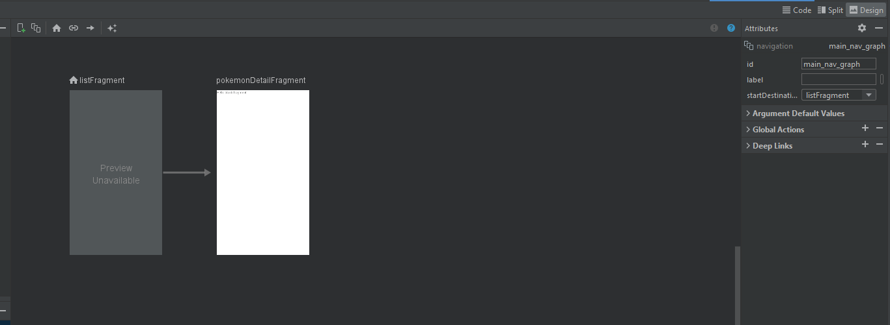

## Fragments: 

Son como Activities pero mas pequeñas que están dentro de una Activity siempre, y se comunican entre ellos mediante la Activity. Nunca directamente. Un fragment va a llamar al activity padre y ese activity va a dar una indicación al segundo fragment. 

El fragment también tiene su propio ciclo de vida.

Entonces es como si tuviéramos dos (o más?) pantallas en una sola y cada una de estas pantallas o sub pantallas tiene su propio ciclo de vida y puede actuar de manera independiente una de otra.

Ejemplo de dos fragments: 

Abajo podríamos tener una lista o un ListView de productos y arriba podríamos tener el detalle del producto seleccionado.

Entonces cuando damos clic en un elemento de la lista, mostrariamos el detalle en el otro fragment de nuestra Activity. 

Nos ayudan a que nuestra aplicación sea mucho mas versatil. 

Son muy utiles y muy usados para aplicaciones para tablets por ejemplo. 

### Ciclo de vida de un fragment: 

Muy similar al de un activity: onCreate(), onStart(), onResume(), onPause(), onStop(), onDestroyView() son compartidos con el ciclo de vida de la activity. 

onAttach(), onCreateView(), onActivityCreated(), onDestroyView(), onDestroy() y onDetach() son propios del ciclo de vida de un fragment. 

OnAttach: se manda a llamar cuando el fragment es creado y se asocia a la activity. 

onCreatedView: nos sirve para crear los views que va a contener el fragment activity

onActivityCreated: se manda a llamar cuando el onCreate del activity termina de ejecutarse

onDestroyView: va a destruir todos los views que creamos en onCreatedView

onDestroy: va a destruir el fragment

onDetach: va a desasociar el fragment del activity. 

----------------------

## Nuevo proyecto: Pokedex para aplicar fragments.

Esta aplicación consta de dos fragments. 

El de abajo es la lista de donde vamos a elegir nuestro pokemon

El de arriba es la imagen y las caracteristicas del pokemos escogido.

1- Armamos nuestra estructura de fragments dentro de nuestro RelativeLayout

2- Desde Java y nuestro paquete principal de app vamos a crear un New Fragment -> Fragment (Blank)

3- Lo voy a llamar ListFragment y doy Finish. Nos va a crear nuestro ListFragment.kt y nuestro fragment_list.xml

4- Voy a quitar de mi ListFragment.kt todo lo que no voy a usar:
- Borro el companion object completo
- Tmp voy a necesitar el metodo onCreate()
- Solo voy a dejar el metodo onCreateView() y lo demas se va. Así quedaría parcialmente. 


```kotlin
class ListFragment : Fragment() {
    override fun onCreateView(
        inflater: LayoutInflater, container: ViewGroup?,
        savedInstanceState: Bundle?
    ): View? {
        // Inflate the layout for this fragment
        return inflater.inflate(R.layout.fragment_list, container, false)
    }
}
```

5- Ahora vamos a editar el fragment_list.xml que basicamente consiste en meterle un RecyclerView. 

6- Para hacer esto posible debemos agregar la dependencia en nuestro build.gradle: 

```kotlin
implementation 'androidx.recyclerview:recyclerview:1.3.0'
```

Luego sincronizamos y cambiamos el FrameLayout que viene por defecto en nuestro fragment_list por un recyclerview. Queda así: 

```xml
<?xml version="1.0" encoding="utf-8"?>
<androidx.recyclerview.widget.RecyclerView xmlns:tools="http://schemas.android.com/tools"
    xmlns:android="http://schemas.android.com/apk/res/android"
    android:layout_width="match_parent"
    android:layout_height="match_parent"
    tools:context=".ListFragment" />
```

Listo ya tenemos nuestro ListFragment. 

7- Vamos a armar ahora nuestro segundo fragment llamado: DetailFragment

8- Adaptamos nuevamente nuestro fragment al igual que lo hicimos con el anterior. Solo que en este caso no será el xml un recycler view sino un LinearLayouy de orientation vertical 

(ver .xml y .kt de nuestros fragments en este repo)

9- Luego vamos a indicar en el activity_main.xml que fragment de los que tenemos corresponde a que fragment de los que creamos arriba con el atributo android:name=""

Así quedaría nuestro activity_main.xml

```xml
<?xml version="1.0" encoding="utf-8"?>
<layout xmlns:tools="http://schemas.android.com/tools"
    xmlns:android="http://schemas.android.com/apk/res/android">

    <data>

    </data>

    <RelativeLayout
        android:layout_width="match_parent"
        android:layout_height="match_parent"
        tools:context=".MainActivity">

        <androidx.fragment.app.FragmentContainerView
            android:id="@+id/detail_fragment"
            android:name="com.example.pokemoskotlin.DetailFragment"
            android:layout_width="match_parent"
            android:layout_height="250dp" />

        <androidx.fragment.app.FragmentContainerView
            android:id="@+id/list_fragment"
            android:name="com.example.pokemoskotlin.ListFragment"
            android:layout_width="match_parent"
            android:layout_height="wrap_content"
            android:layout_below="@+id/detail_fragment"
            android:layout_alignParentBottom="true"/>

    </RelativeLayout>
</layout>
```
**Dato importante: Para trabajar con Adapters nuestro objetos deben ser data class. No solo class. Dado que sino nos va a arrojar un error en la igualación del oldItem == newItem de la override fun areContentsTheSame() en el companion object de nuestro adapter.**

-----------------------------

***¿Como pasar datos de un fragment a una activity?***

*Regla: No hay que pasar datos entre fragments directamente, sino que debemos pasar los datos de un fragment a una activity y de esta ultima al otro fragment.* 

1- Creo una interface en mi ListFragment a la que voy a llamar PokemonSelectListener {}. 

2- La misma va a tener un metodo dentro que se va a llamar onPokemonSelected(pokemon: Pokemon)

3- Creamos una private lateinit var llamada pokemonSelectedListener: PokemonSelectListener

4- Sobreescribimos luego el metodo del fragment onAttach que es el metodo del fragment cuando se adhiere a la activity. override fun onAttach(context: Context) {}

------------------------

**Stop**

### Breve repaso de interfaces y clases en Kotlin: 

Imagina que estás en un restaurante y tienes que pedir tu comida al mesero. El mesero es como la interface en Kotlin, ya que es la conexión entre tú y la cocina (que sería como una clase). El mesero te presenta un menú con opciones de comida, al igual que una interface te presenta un conjunto de métodos que puedes usar.

Ahora, cuando haces tu pedido al mesero, le dices exactamente qué quieres y cómo lo quieres preparado. Esto es como cuando implementas una interface en una clase en Kotlin. La clase tiene que decirle exactamente qué métodos va a usar y cómo los va a utilizar.

La diferencia entre una interface y una clase en Kotlin es que una interface es como un contrato que obliga a cualquier clase que la implemente a utilizar los métodos que define la interface. Es decir, cualquier clase que implemente una interface debe proporcionar una implementación de todos los métodos que la interface define. Mientras que una clase es una estructura de programación que puede tener variables, métodos, constructores, etc., y no está limitada por un contrato predefinido.

En resumen, una interface es una conexión que define qué métodos se pueden utilizar, mientras que una clase es una estructura que puede definir sus propios métodos y variables.

**Ejemplo:**

Supongamos que estamos desarrollando un juego de carreras de autos. En este juego, tendremos varios tipos de vehículos, como autos deportivos, camiones, motocicletas, etc.

En este caso, podríamos definir una clase llamada "Vehículo" que tenga propiedades como velocidad máxima, aceleración, modelo, etc. Esta clase serviría como base para todos los vehículos en el juego, y cada tipo de vehículo tendría su propia instancia de la clase "Vehículo".

Ahora, supongamos que queremos que todos los vehículos tengan la capacidad de acelerar y frenar. Podríamos definir una interface llamada "MétodosDeConducción" que tenga los métodos "acelerar" y "frenar".

Cada tipo de vehículo tendría que implementar esta interface para poder acelerar y frenar. Por ejemplo, el auto deportivo tendría su propia implementación de los métodos "acelerar" y "frenar", mientras que el camión tendría su propia implementación de estos métodos.

De esta manera, podemos garantizar que todos los vehículos tengan la capacidad de acelerar y frenar, al mismo tiempo que permitimos que cada tipo de vehículo tenga su propia implementación personalizada de estos métodos.

```kotlin
// Definición de la clase Vehículo
class Vehiculo(val velocidadMaxima: Int, val aceleracion: Double, val modelo: String) {
    // Aquí irían las propiedades y métodos específicos de cada tipo de vehículo
}

// Definición de la interface MétodosDeConducción
interface MétodosDeConducción {
    fun acelerar()
    fun frenar()
}

// Definición de la clase AutoDeportivo que hereda de la clase Vehiculo y implementa la interface MétodosDeConducción
class AutoDeportivo(velocidadMaxima: Int, aceleracion: Double, modelo: String) : Vehiculo(velocidadMaxima, aceleracion, modelo), MétodosDeConducción {
    override fun acelerar() {
        // Implementación específica para el auto deportivo
    }

    override fun frenar() {
        // Implementación específica para el auto deportivo
    }
}

// Definición de la clase Camión que hereda de la clase Vehiculo y implementa la interface MétodosDeConducción
class Camion(velocidadMaxima: Int, aceleracion: Double, modelo: String) : Vehiculo(velocidadMaxima, aceleracion, modelo), MétodosDeConducción {
    override fun acelerar() {
        // Implementación específica para el camión
    }

    override fun frenar() {
        // Implementación específica para el camión
    }
}
```

*Este código define la clase Vehiculo que tiene propiedades comunes a todos los vehículos, como velocidad máxima, aceleración y modelo. También define la interface MétodosDeConducción que tiene los métodos acelerar() y frenar().*

*Luego, se definen las clases AutoDeportivo y Camion heredan las propiedades y métodos de la clase Vehiculo, y al mismo tiempo, implementan la interface MétodosDeConducción. Así, ambas clases tienen acceso a las características comunes de todos los vehículos y también pueden acelerar y frenar.*

-------------------------

Volvamos ahora si al paso de datos de un fragment a una activity. Nos habiamos quedado en el punto 4. Por lo que retomamos desde ahí: 

Quedaría así todo lo agregado en los 4 puntos de arriba a mi ListFragment: 

```kotlin
class ListFragment : Fragment() {

    interface PokemonSelectListener {
        fun onPokemonSelected(pokemon: Pokemon)
    }

    private lateinit var  pokemonSelectListener: PokemonSelectListener

    override fun onAttach(context: Context) {
        super.onAttach(context)
        pokemonSelectListener = try {
            context as PokemonSelectListener
        } catch (e: ClassCastException) {
            throw ClassCastException("$context must implement PokemonSelectListener")
        }
    }
    // ... more code
}
```
Este codigo que sumamos lo que hace es obligar a MainActivity a implementar PokemonSelectListener y sino lo hace entonces la app se va a romper y nos va a arrojar una excepción de tipo ClassCastException

Por lo que debemos hacer entonces en MainActivity esta implementación. Lo cual significa que debe heredar esta interface ademas de heredar lo que ya hereda.  

Esto nos va a obligar a implementar el metodo de nuestra interface llamado onPokemonSelected(pokemon: Pokemon)

Luego vamos a modificar la acción del adapter.onItemClickListener, actualmente arroja un Toast, pero vamos a hacer otra cosa en su lugar. 

De esta manera se va a ejecutar el metodo que acabamos de sobreescribir en MainActivity y esta es una de las formas de pasar datos de un fragment a una activity. 

Existe una forma alternativa que vamos a poner y luego comentar: 

Creo en MainActivity una función a la que voy a llamar iAmYourFather(pokemon: Pokemon) {}

Luego en ListFragment donde damos click al pokemon escribimos: 
(activity as MainActivity).iAmYourFather(it)

Así quedaría el ListFragment con las dos alternativas: 

```kotlin
class ListFragment : Fragment() {

    interface PokemonSelectListener {
        fun onPokemonSelected(pokemon: Pokemon)
    }

    private lateinit var  pokemonSelectListener: PokemonSelectListener

    override fun onAttach(context: Context) {
        super.onAttach(context)
        pokemonSelectListener = try {
            context as PokemonSelectListener
        } catch (e: ClassCastException) {
            throw ClassCastException("$context must implement PokemonSelectListener")
        }
    }

    override fun onCreateView(
        inflater: LayoutInflater, container: ViewGroup?,
        savedInstanceState: Bundle?
    ): View? {
        // Inflate the layout for this fragment
        val view = FragmentListBinding.inflate(inflater)

        val recycler = view.pokemonRecycler

        // Para el layout manager en la activity pasabamos this como contexto. Pero el fragment no tiene contexto por si solo.
        // Debemos pedirle el contexto a la activity
        recycler.layoutManager = LinearLayoutManager(requireActivity())

        // Challenge: Crear el adaptar para nuestro recycler!!!
        val adapter = PokemonAdapter()

        view.pokemonRecycler.adapter = adapter

        adapter.onItemClickListener = {
            pokemonSelectListener.onPokemonSelected(it)
            (activity as MainActivity).iAmYourFather(it)
        }
        // ... more code
    }
}
```

Así quedaría el MainActivity con las dos formas: 

```kotlin
class MainActivity : AppCompatActivity(), ListFragment.PokemonSelectListener {
    override fun onCreate(savedInstanceState: Bundle?) {
        super.onCreate(savedInstanceState)
        val binding = ActivityMainBinding.inflate(layoutInflater)
        setContentView(binding.root)
    }

    override fun onPokemonSelected(pokemon: Pokemon) {
        TODO("Not yet implemented")
    }

    fun iAmYourFather(pokemon: Pokemon) {
        TODO("Not yet implemented")
    }
}
```

**Esta última forma solo sirve si el fragment lo vamos a usar en una única activity. Si vamos a reusar nuestro fragment en mas de una activity entonces los que debemos hacer es usar la primer forma que consiste en sobreescribir el metodo de nuestra interface creada en el fragment en cada una de las activities en donde sea utilizada.**

Yo voy a dejar ahora solo la forma con interface que es la que serviría para mas de una activity. 

----------------------

Ahora que ya pasamos los datos del Fragment a la Activity tenemos que ver como pasamos los datos de nuestra activity al otro fragment que era nuestro objetivo inicial: 

1- Nuestro otro fragment se llama Detail Fragment y allí también vamos a crear una val view, dodo que returnabamos la misma en linea hasta acá. Y luego retornamos la misma

2- Voy a crear 5 private lateinit var, 1 por cada uno de los elementos que debo pintar en el view. En este caso son imageView: ImageView, hpText: TextView, attackText: TextView, defenseText: TextView, speedText: TextView. Estas variables deben ser de alcance global. Es decir, deben estar fuera del metodo onCreateView().

3- Luego las voy a inicializar dentro del metodo onCreateView()

4- Creo un metodo publico al que en este caso voy a llamar setPokemonData(pokemon: Pokemon){} donde voy a definir los textos de cada una de mis views con los datos de mi objeto pokemon que traigo a este fragment

5- En MainActivity voy a declarar una variable como private lateinit var, de alcance global en la clase, private lateinit var detailFragment: DetailFragment

6- En el metodo onCreate voy a inicializar al detailFragment. 
A- Lo puedo hacer con supportFragmentManager.findFragmentById(R.id.detail_fragment) as DetailFragment ó
B- ¿Como dataBinding? Descubrir // Deje pregunta en el curso. Pero por mí cuenta no he encontrado la forma. 

7- Luego vamos a pasar el pokemon que recibimos en el metodo de MainActivity onPokemonSelected(pokemon: Pokemon) al detailFragment que acabamos de instanciar en el paso de arriba a traves del uso del metodo del detail fragment llamado setPokemonData(pokemon)

Así quedaría entonces el DetailFragment: 

```kotlin
package com.example.pokemoskotlin

import android.os.Bundle
import androidx.fragment.app.Fragment
import android.view.LayoutInflater
import android.view.View
import android.view.ViewGroup
import android.widget.ImageView
import android.widget.TextView
import com.example.pokemoskotlin.databinding.FragmentDetailBinding

class DetailFragment : Fragment() {

    private lateinit var imageView: ImageView
    private lateinit var hpText: TextView
    private lateinit var attackText: TextView
    private lateinit var defenseText: TextView
    private lateinit var speedText: TextView


    override fun onCreateView(
        inflater: LayoutInflater, container: ViewGroup?,
        savedInstanceState: Bundle?
    ): View? {
        // Inflate the layout for this fragment
        val view = FragmentDetailBinding.inflate(inflater)

        imageView = view.fragmentDetailImage
        hpText = view.fragmentDetailHp
        attackText = view.fragmentDetailAttack
        defenseText = view.fragmentDetailDefense
        speedText = view.fragmentDetailSpeed

        return view.root
    }

    fun setPokemonData(pokemon: Pokemon) {
        hpText.text = pokemon.hp.toString()
        attackText.text = pokemon.attack.toString()
        defenseText.text = pokemon.defense.toString()
        speedText.text = pokemon.speed.toString()
    }
}
```

Así quedaría entonces el MainActivity: 

```kotlin
class MainActivity : AppCompatActivity(), ListFragment.PokemonSelectListener {

    private lateinit var detailFragment: DetailFragment
    private lateinit var binding: ActivityMainBinding

    override fun onCreate(savedInstanceState: Bundle?) {
        super.onCreate(savedInstanceState)
        binding = ActivityMainBinding.inflate(layoutInflater)
        setContentView(binding.root)

        detailFragment = supportFragmentManager.findFragmentById(R.id.detail_fragment) as DetailFragment
    }

    override fun onPokemonSelected(pokemon: Pokemon) {
        detailFragment.setPokemonData(pokemon)
    }
}
```

Finalmente vamos a darle a las TextView´s donde mostramos el hp, ataque, defensa y velocidad un formato en el que no solo mostremos el numero sino también que estamos mostrando. 

Para eso vamos a crear los formatos en strings.xml así

```xml
<resources>
    <string name="app_name">Pokemos Kotlin</string>
    <string name="hp_format">Hp: %d</string>
    <string name="attack_format">Attack: %d</string>
    <string name="defense_format">Defense: %d</string>
    <string name="speed_format">Speed: %d</string>
</resources>
```

Luego vamos a DetailFragment y editamos el momento en el que asignamos los valores así: 

```kotlin
fun setPokemonData(pokemon: Pokemon) {
    hpText.text = getString(R.string.hp_format, pokemon.hp)
    attackText.text = getString(R.string.attack_format, pokemon.attack)
    defenseText.text = getString(R.string.defense_format, pokemon.defense)
    speedText.text = getString(R.string.speed_format, pokemon.speed)
    }
```

Bien. Con esto ya muestra el Hp, attack, defense y speed, en función del pokemos que escojamos pero aún seguimos con la imagen hardcodeada y sin sonido. 

Vamos entonces a usar Glide para traer imagenes desde internet...

-----------------------------

Para traer imagenes de internet en Android se usa Glide o en su defecto Picasso. 

**Glade:**

La documentación de glide podemos encontrarla acá: 

https://github.com/bumptech/glide

1- Debemos importar Glide en el fragment en el cual vayamos a cargar nuestra imagen que traeremos de internet.

2- Luego ubicaremos a Glide dentro del metodo de nuestro fragment que se ocupre de asignar valores a las View´s que conforman el fragment

3- Las imagenes deben estar pre procesadas y tener un tamaño fijo cuando vas a hacer un proyecto de verdad. En este caso vamos a buscar imagenes horizontales solamente. 

4- Dentro del load cargo entonces la propiedad de mi objeto donde guardo el enlace a la foto de internet. 

**IMPORTANTISIMO: Si no agregamos el permiso de internet en el manifest o no va a traer nuestras fotos o lo hará de forma muy lenta...**

5- Agrego en el manifiest el permiso de internet así: 

```xml
 <uses-permission android:name="android.permission.INTERNET" />
```

La primera que hagamos click sobre un pokemon va a tardar un poco dado que descarga la imagen. Pero una vez que la tenemos descargada la misma queda en la cache por lo que luego si volvemos a seleccionar el mismo pokemon no tendremos problemas de demora. 

-------------------------

**Manejando "carga" y errores en Glade:** 

1- Vamos a ir a donde estamos implementando Glide. En este caso al DetailFragment en su metodo setPokemonData() {}

2- Vamos a reemplazar el ".into(imageView) por .listener(object: RequestListener< Drawable >{}).into(imageView)

3- Me marcará en rojo "object" y si posiciono en el me sugerirá "implementar miembros". Son dos metodos de la interface RequestListener los que debo implementar para luego editar. 

4- El primer metodo va a aplicar cuando falle la carga de nuestra imagen. El segundo metodo va a aplicar cuando termine de cargarse la imagen finalmente. 

5- Entonces aprovechando el segundo metodo voy a ir al fragment_layout.xml y voy a meter a mi ImageView dentro de un FrameLayout donde va a convivir con una ProgressBar y se mostrará esta ultima hasta tanto la imagen esté cargada. Cuando esto ultimo ocurra voy a ocultar la progress bar y voy a mostrar la image view. 

6- Voy a crear mi private lateinit var loadingWheel en mi DetailFragment.kt y luego voy a inicializarla en el onCreateView()

7- Entonces apenas invocamos a setPokemonData(), es decir, cuando queremos cargar una imagen vamos a cambiar la visibilidad de loadingWheel de GONE a VISIBLE y luego, cuando termina la carga ( onResourceReady() ) vamos a volver a ocultarla. Si la descarga falló también la ocultamos de nuevo. 

8- onLoadFailed & onResourceReady te piden que devuelvas un boolean para hacer mas cosas con target, pero por el momento no las vamos a hacer. Por lo que vamos a retornar un false para que compile en ambos metodos sobre escritos. 

9- Adicionalmente, cuando la descarga falle, POR UNA EXCEPCION, vamos a mostrar una imagen por default para estos casos.

10- Si quiero manejar también la posibilidad de que la descarga falle porque la url era incorrecta entonces debemos hacer una modificación... Quitamos al final el ".into(imageView)" y agregamos ".error(R.drawable.ic_image_not_supported_black).into(imageView)"

Así queda entonces nuestro codigo del DetailFragment con la implementación completa de Glide, manejo de carga, errores y excepciones: 

```kotlin
class DetailFragment : Fragment() {

    private lateinit var imageView: ImageView
    private lateinit var hpText: TextView
    private lateinit var attackText: TextView
    private lateinit var defenseText: TextView
    private lateinit var speedText: TextView
    private lateinit var loadingWheel: ProgressBar


    override fun onCreateView(
        inflater: LayoutInflater, container: ViewGroup?,
        savedInstanceState: Bundle?
    ): View? {
        // Inflate the layout for this fragment
        val view = FragmentDetailBinding.inflate(inflater)

        imageView = view.fragmentDetailImage
        hpText = view.fragmentDetailHp
        attackText = view.fragmentDetailAttack
        defenseText = view.fragmentDetailDefense
        speedText = view.fragmentDetailSpeed
        loadingWheel = view.loadingWheel

        return view.root
    }

    fun setPokemonData(pokemon: Pokemon) {

        loadingWheel.visibility = View.VISIBLE
        // Podemos usar this, porque Glide admite fragments:
        Glide.with(this).load(pokemon.imageUrl)
            .listener(object: RequestListener<Drawable>{

                override fun onLoadFailed(
                    e: GlideException?,
                    model: Any?,
                    target: Target<Drawable>?,
                    isFirstResource: Boolean
                ): Boolean {
                    loadingWheel.visibility = View.GONE
                    imageView.setImageResource(R.drawable.ic_image_not_supported_black)
                    return false
                }

                override fun onResourceReady(
                    resource: Drawable?,
                    model: Any?,
                    target: Target<Drawable>?,
                    dataSource: DataSource?,
                    isFirstResource: Boolean
                ): Boolean {
                    loadingWheel.visibility = View.GONE
                    return false
                }
            })
            .error(R.drawable.ic_image_not_supported_black)
            .into(imageView)

        hpText.text = getString(R.string.hp_format, pokemon.hp)
        attackText.text = getString(R.string.attack_format, pokemon.attack)
        defenseText.text = getString(R.string.defense_format, pokemon.defense)
        speedText.text = getString(R.string.speed_format, pokemon.speed)
    }
}
```

------------------------------

**Picasso:** 

Picasso es otra de las librerías más utilizadas en Android para descargar fotos fácilmente.

Puedes encontrar la documentación de la librería aquí: https://square.github.io/picasso/

-------------------------------

Ahora vamos a aprender a agregar sonidos para nuestros pokemones. En realidad vamos a aprender a agregar sonidos a  cualquier aplicación con esto: 

1- Vamos "res", botón derecho, New, Android Resource Directory y en resource type vamos a seleccionar "raw" y le dejamos ese mismo nombre que viene por default. 

2- En la carpeta raw es donde van a estar los sonidos. 

3- Lleno la carpeta raw con todos los sonidos que necesito para mis pokemones. Esto se puede hacer directamente pegandolos (ctrl+v) dentro de la carpeta "raw". 

4- Para poder obtener los sonidos de un pokemon debemos hacerlo igual que como hacemos con los dibujos, es decir, desde R.raw.nombre_sonido

5- Sumo el atributo sonido de tipo Int en mi clase pokemon y luego en DetailFragment, en el metodo setPokemonData() {} es donde vamos a ejecutar ese sonido. 

6- Para esto vamos a tener que crear una val mediaPlayer

7- Una completa la variable vamos poner mediaPlayer.start() y eso hará que se reproduzca el sonido al seleccionar un pokemon de la lista. 

Veamos entonces como queda el codigo del DetailActivity: 

```kotlin
class DetailFragment : Fragment() {

    private lateinit var imageView: ImageView
    private lateinit var hpText: TextView
    private lateinit var attackText: TextView
    private lateinit var defenseText: TextView
    private lateinit var speedText: TextView
    private lateinit var loadingWheel: ProgressBar


    override fun onCreateView(
        inflater: LayoutInflater, container: ViewGroup?,
        savedInstanceState: Bundle?
    ): View? {
        // Inflate the layout for this fragment
        val view = FragmentDetailBinding.inflate(inflater)

        imageView = view.fragmentDetailImage
        hpText = view.fragmentDetailHp
        attackText = view.fragmentDetailAttack
        defenseText = view.fragmentDetailDefense
        speedText = view.fragmentDetailSpeed
        loadingWheel = view.loadingWheel

        return view.root
    }

    fun setPokemonData(pokemon: Pokemon) {

        loadingWheel.visibility = View.VISIBLE
        // Podemos usar this, porque Glide admite fragments:
        Glide.with(this).load(pokemon.imageUrl)
            .listener(object: RequestListener<Drawable>{

                override fun onLoadFailed(
                    e: GlideException?,
                    model: Any?,
                    target: Target<Drawable>?,
                    isFirstResource: Boolean
                ): Boolean {
                    loadingWheel.visibility = View.GONE
                    imageView.setImageResource(R.drawable.ic_image_not_supported_black)
                    return false
                }

                override fun onResourceReady(
                    resource: Drawable?,
                    model: Any?,
                    target: Target<Drawable>?,
                    dataSource: DataSource?,
                    isFirstResource: Boolean
                ): Boolean {
                    loadingWheel.visibility = View.GONE
                    return false
                }
            })
            .error(R.drawable.ic_image_not_supported_black)
            .into(imageView)

        hpText.text = getString(R.string.hp_format, pokemon.hp)
        attackText.text = getString(R.string.attack_format, pokemon.attack)
        defenseText.text = getString(R.string.defense_format, pokemon.defense)
        speedText.text = getString(R.string.speed_format, pokemon.speed)

        val mediaPlayer = MediaPlayer.create(requireActivity(), pokemon.soundId)
        mediaPlayer.start()
    }
}
```

-------------------------------

**Agregando soporte para Fragment Navigation:**

Vamos a crear nuestro recyclerview y lo vamos a hacer en nuestro ListFragment. 

**IMPORTANTE: Todo lo que hacemos en la activity a nivel de onCreate(), lo vamos a hacer en el fragment a nivel de onCreateView()**

--------------------------

**Soporte para fragment navigatión**

Dependencias en Kotlin: 

```kotlin
implementation 'androidx.navigation:navigation-fragment-ktx:2.5.3'
implementation 'androidx.navigation:navigation-ui-ktx:2.5.3'
```

Tambien debemos sumar un Safe Args en el build.gradle (Top level) es decir, el de project. No el de app. Así quedaría el build.gradle (project)

```kotlin
// Top-level build file where you can add configuration options common to all sub-projects/modules.
buildscript {
    repositories {
        google()
    }
    dependencies {
        def nav_version = "2.5.3"
        classpath "androidx.navigation:navigation-safe-args-gradle-plugin:2.5.3"
    }
}
plugins {
    id 'com.android.application' version '7.4.2' apply false
    id 'com.android.library' version '7.4.2' apply false
    id 'org.jetbrains.kotlin.android' version '1.8.0' apply false
}
```

Finalmente debemos sumar un plugin (id 'androidx.navigation.safeargs.kotlin') a nuestro build.gradle(app). El mismo es: 

```kotlin
plugins {
    id 'kotlin-android'
    id 'kotlin-kapt'
    id 'com.android.application'
    id 'org.jetbrains.kotlin.android'
    id 'kotlin-parcelize'
    id 'androidx.navigation.safeargs.kotlin'
}
```
---------------------------

**¿Que vamos a hacer ahora con "navigatión" instalado en Android Studio? **

Quitar el fragment de la parte superior de la activity y ponerlo en una activy nueva para mostrarlo separado.

Creo un nuevo fragment al que voy a llamar "PokemonDetailFragment" pero voy a dejar aún y para que sirva de ejemplo a otros projectos el "DetailFragment" que ya no voy a usar. 

RECORDATORIO: Del fragment que viene por default solo me voy a quedar con el metodo onCreateView(), el resto elimino todo. 

Luego, vamos a crear en "res" un New -> Android Resource Directory. En resource type vamos a seleccionar "navigation". Lo que va a configurar con el mismo nombre a esta carpeta. 

En la carpeta de navigation vamos a crear el archivo **main_nav_graph**

Dentro del archivo de navigation voy a establecer los dos fragment (podrían ser activities tambien) que van a estar conectados en mi navegación de forma visual a traves de la sección "Design".

Voy a establecer una relación entre "listFragment" y "pokemonDetailFragment" a traves de un vinculo lineal entre ambos fragments. 

Podemos ir y ver el codigo que se generó con este diseño. Pero en este caso es claramente mas facil hacerlo directamente desde design: 

Codigo: 

```xml
<?xml version="1.0" encoding="utf-8"?>
<navigation xmlns:android="http://schemas.android.com/apk/res/android"
    xmlns:app="http://schemas.android.com/apk/res-auto"
    xmlns:tools="http://schemas.android.com/tools"
    android:id="@+id/main_nav_graph"
    app:startDestination="@id/listFragment">

    <fragment
        android:id="@+id/listFragment"
        android:name="com.example.pokemoskotlin.ListFragment"
        android:label="ListFragment" >
        <action
            android:id="@+id/action_listFragment_to_pokemonDetailFragment"
            app:destination="@id/pokemonDetailFragment" />
    </fragment>
    <fragment
        android:id="@+id/pokemonDetailFragment"
        android:name="com.example.pokemoskotlin.PokemonDetailFragment"
        android:label="fragment_pokemon_detail"
        tools:layout="@layout/fragment_pokemon_detail" />
</navigation>
```

Diseño: 



Para que esto funcione, debemos quitar los dos fragment del layout de MainActivity. Y lo vamos a reemplazar por un **FragmentContainerView**. Quedaría así el MainActivity: 

```kotlin
<?xml version="1.0" encoding="utf-8"?>
<layout xmlns:tools="http://schemas.android.com/tools"
    xmlns:android="http://schemas.android.com/apk/res/android"
    xmlns:app="http://schemas.android.com/apk/res-auto">

    <data>

    </data>

    <RelativeLayout
        android:layout_width="match_parent"
        android:layout_height="match_parent"
        tools:context=".MainActivity">

        <androidx.fragment.app.FragmentContainerView
            android:id="@+id/main_navigation_container"
            android:name="androidx.navigation.fragment.NavHostFragment"
            android:layout_width="match_parent"
            android:layout_height="match_parent"
            app:defaultNavHost="true"
            app:navGraph="@navigation/main_nav_graph"
            />

    </RelativeLayout>
</layout>
```

Luego vamos a ir a el fragment_pokemon_detail.xml y vamos a pegar lo mismo que tenemos en el fragment_detail.xml...

--------------------------------------

**¿Como pasar datos entre fragments utilizando navigation?**

1- En el list fragment escuchamos los click sobre nuestra lista. Y cuando se produce pasamos los datos al detail fragment mediante el main activity. Esto ya no lo vamos a hacer mas. 

2- Reemplazo en el onPokemonSelected() del main activity lo que borre en el punto 1 con: 
findNavController(R.id.main_navigation_container).navigate(ListFragmentDirections.actionListFragmentToPokemonDetailFragment()). 
Con esto ya se abré el siguiente fragment pero áun no le estamos pasando los datos. 

3- En Android, pasar datos de un fragment a otro sae conoce como: **pasar argumentos**. Los safe args que agregamos al instalar navigation son los argumentos, es decir, son los datos que pasamos de un fragment a otro. 

4- Dentro de main_nav_graph bajo la modalidad de design voy a seleccionar el fragment de destino de los arguments e ir a la sección de la derecha que dice "Arguments". Allí voy apretar sobre el signo "+" para agregar un argumento. 

5- Vamos a cargar el primer argumento: 
Name: pokemonName
Type: string.
Luego voy a ir a la sección de codigo y voy a cargar en el argument que se genero un android:defaultValue=""
Esto para que no trone la aplicación en caso de que se nos olvide pasarlos. 

6- Vamos a ir ahora a PokemonDetailFragment y allí es donde vamos a recibir los argumentos. Alli:
Agrego:
private val args: PokemonDetailFragment by navArgs()

IMPORTANTE: Si fallá debo ir a build.gradle (app) y agregar:

```kotlin
kotlinOptions {
    jvmTarget = JavaVersion.VERSION_1_8.toString()
}
```

Luego inflo el layout con dataBinding(Puede ser también sin el mediante R.layout.{name_layout}) y guardo el layout en una variable llamada view y luego la retorno desde onCreateView con su metodo .root

7- Voy a crear una variable llamada pokemonName = args.pokemonName

8- Voy a crear en el Layout del Fragment (fragment_pokemon_detail) una TextView para mostrar el nombre del pokemon que estoy pasando. 

9- Volvemos al fragment y vamos a identificar a esta view que acabamos de crear. Yo lo voy a hacer con dataBinding, pero también se puede hacer con findViewById.

10- Una vez hecho esto vamos pasar como .text del nameText que acabamos de crear el pokemonName que creamos en el punto 7. Y con esto ya estariamos mostrando los datos en el fragment de destino. Pero... Aún no los estamos enviando del primer fragment. Por lo que debemos hacer algunas cosas mas. 

11- Dentro del MainActivity en la función de onPokemonSelected(pokemon: Pokemon) {}
vamos a pasarle en el parentesis vacio que teniamos del "actionListFragmentToPokemonDetailFragment({args... // los mismos salen del objeto que recibe}). Por ejemplo en este caso sería el pokemon.name

12- Hecho esto deberíamos ver que se pasa el nombre al segundo fragment.

13- Si bien podemos pasar los distintos atributos del pokemon de forma individual tal como lo hicimos con pokemonName podemos también pasar un objeto completo. En este caso un pokemon. Para eso debemos editar el **argument que se nos generó en el main_nav_graph.xml** y quitamos el defaultValue

14- Vamos a hacer esto:
```xml
<argument
    android:name="pokemon"
    app:argType="com.example.pokemoskotlin.Pokemon"/>
```
15- Como recordaremos, para pasar un objeto de una activity a otra se necesita un @Parcelize en la clase de ese objeto. Eso vamos a hacer con nuestra clase Pokemon. Quedando así: 

```kotlin
@Parcelize
data class Pokemon(val id: Long, val name: String, val hp: Int, val attack: Int, val defense: Int,
                   val speed: Int, val type: PokemonType, val imageUrl: String, val soundId: Int) :
    Parcelable {

    enum class PokemonType {
        GRASS, FIRE, WATER, FIGHTER, ELECTRIC
    }
}
```
16- Ahora cambiamos en el MainActivity dentro del metodo onPokemonSelected y en lugar de pasar un "pokemon.name" vamos a pasar un "pokemon" solo. 

17- modificamos el archivo de PokemonDetailFragment dado que antes recibiamos un pokemonName y mostrabamos un nombre y ahora es un objeto. 

18- Copiamos y pegamos el metodo del DetailFragment llamado setPokemonData en el PokemonDetailFragment

19- Configuro el metodo copiado como privado dado que solo va a ser llamado desde este mismo fragment. 

20- Vuelvo a DetailFragment y busco todas las private lateinit var para que el metodo copiado pueda servirse de ellas. 

21- Copiamos y pegamos tambien del DetailFragment todas las asignaciónes de las variables que estaban dentro del onCreateView.

**22- Asignamos en onCreateView el valor del nameText que es la nueva View que antes no teniamos. Y para asignar todas las demas view usamos el metodo setPokemonData pasandole el pokemon que me traigo desde navigation**

Así queda entonces mi PokemonDetailFragment: 

```kotlin
package com.example.pokemoskotlin

import android.graphics.drawable.Drawable
import android.media.MediaPlayer
import android.os.Bundle
import androidx.fragment.app.Fragment
import android.view.LayoutInflater
import android.view.View
import android.view.ViewGroup
import android.widget.ImageView
import android.widget.ProgressBar
import android.widget.TextView
import androidx.navigation.fragment.navArgs
import com.bumptech.glide.Glide
import com.bumptech.glide.load.DataSource
import com.bumptech.glide.load.engine.GlideException
import com.bumptech.glide.request.RequestListener
import com.bumptech.glide.request.target.Target
import com.example.pokemoskotlin.databinding.FragmentPokemonDetailBinding

class PokemonDetailFragment : Fragment() {

    private lateinit var imageView: ImageView
    private lateinit var hpText: TextView
    private lateinit var attackText: TextView
    private lateinit var defenseText: TextView
    private lateinit var speedText: TextView
    private lateinit var loadingWheel: ProgressBar
    private lateinit var nameText: TextView

    private val args: PokemonDetailFragmentArgs by navArgs()
    override fun onCreateView(
        inflater: LayoutInflater, container: ViewGroup?,
        savedInstanceState: Bundle?
    ): View? {
        // Inflate the layout for this fragment
        val view = FragmentPokemonDetailBinding.inflate(inflater)

        val pokemon = args.pokemon

        imageView = view.fragmentDetailImage
        hpText = view.fragmentDetailHp
        attackText = view.fragmentDetailAttack
        defenseText = view.fragmentDetailDefense
        speedText = view.fragmentDetailSpeed
        loadingWheel = view.loadingWheel

        nameText = view.fragmentDetailName

        // Seteo el nombre de mi nueva view acá y mando a llamar setPokemonData con el pokemon que me traigo de navigation
        nameText.text = pokemon.name
        // Seteo el resto de los datos de mi fragment con el metodo que tengo abajo.
        setPokemonData(pokemon)

        return view.root
    }

    private fun setPokemonData(pokemon: Pokemon) {

        loadingWheel.visibility = View.VISIBLE
        // Podemos usar this, porque Glide admite fragments:
        Glide.with(this).load(pokemon.imageUrl)
            .listener(object: RequestListener<Drawable> {

                override fun onLoadFailed(
                    e: GlideException?,
                    model: Any?,
                    target: Target<Drawable>?,
                    isFirstResource: Boolean
                ): Boolean {
                    loadingWheel.visibility = View.GONE
                    imageView.setImageResource(R.drawable.ic_image_not_supported_black)
                    return false
                }

                override fun onResourceReady(
                    resource: Drawable?,
                    model: Any?,
                    target: Target<Drawable>?,
                    dataSource: DataSource?,
                    isFirstResource: Boolean
                ): Boolean {
                    loadingWheel.visibility = View.GONE
                    return false
                }
            })
            .error(R.drawable.ic_image_not_supported_black)
            .into(imageView)

        hpText.text = getString(R.string.hp_format, pokemon.hp)
        attackText.text = getString(R.string.attack_format, pokemon.attack)
        defenseText.text = getString(R.string.defense_format, pokemon.defense)
        speedText.text = getString(R.string.speed_format, pokemon.speed)

        val mediaPlayer = MediaPlayer.create(requireActivity(), pokemon.soundId)
        mediaPlayer.start()
    }
}
```

**Y... así es como se pasan datos entre fragments usando navigation**

----------------------------------

## Consejo para la creación de productos: 

**Primero hay que hacerlo valioso, luego ligero, luego facil de usar y finalmente bonito. En ese orden de importancia.**

Link para encontrar colores y diseños para nuestros productos: 

https://m3.material.io/styles/color/the-color-system/key-colors-tones

Aqui vamos a encontrar el manejo teorico de colores para app´s de google. 

El concepto clave es que deben haber tres colores: El Primary Key Color, el Secondary Key Color y el Tertiary Key Color

No se deben usar muchos mas colores que esos para que los colores de la aplicación sean **concistentes** y uno tenga la sensación de que sigue en la misma app. 

Busco y establezco tres colores que tengan que ver con los pokemon´s y los establezco como los primeros tres colores de mi colors.xml: 

```xml
<resources>
    <color name="colorPrimary">#F44336</color>
    <color name="colorPrimaryDark">#D32F2F</color>
    <color name="colorAccent">#FEC109</color>
</resources>
```

Luego debo revisar si tengo un archivo de styles.xml. Si no lo tengo lo creo dentro de res / values y lo configuro con mis colores establecidos como los primeros para mi app en colors.xml así: 

```xml
<?xml version="1.0" encoding="utf-8"?>
<resources>
    <!-- base apllication theme -->
    <style name="AppTheme" parent="Theme.AppCompat.Light.DarkActionBar">
        <!-- Customize your theme here -->
        <item name="colorPrimary">@color/colorPrimary</item>
        <item name="colorPrimaryDark">@color/colorPrimaryDark</item>
        <item name="colorAccent">@color/colorAccent</item>
    </style>
</resources>
```
--------------------------

**¿Que otra cosa podemos hacer en styles?** 

Por ejemplo podemos crear un style, con tipo de letra, tamaño, color, etc y luego invocar el mismo en nuestros layouts, ejemplo: los cuatro cuadrados donde mostramos la info del pokemon. 
De esta forma no deberíamos repetir las multiples lineas de estilo en cada View sino que simplemente invocamos el style y listo. 

Width, height y weight pese a que en este caso son iguales, no se recomiendan sumar a los estilos. 

Si en style ya tenemos definido un textSize o cualquier otra variable y luego sumamos esa variable a la configuración de nuestra view va a primar el parametro que sumamos en la view por sobre el parametro que configuramos en nuestro style. 

¿Como?

Borro los elementos que pasé a mi style de mi layout. Ejemplo de que borro en mis TextView del fragment_pokemon_detail.xml:

```xml
android:fontFamily="sans-serif-medium"
android:gravity="center"
android:padding="16dp"
android:textColor="@color/text_black"
android:textSize="18sp"
```

y agrego en su lugar: 

```xml
style="@style/StatText"
```
Así debería quedar nuestro styles.xml: 

```xml
<?xml version="1.0" encoding="utf-8"?>
<resources>
    <!-- base apllication theme -->
    <style name="AppTheme" parent="Theme.AppCompat.Light.DarkActionBar">
        <!-- Customize your theme here -->
        <item name="colorPrimary">@color/colorPrimary</item>
        <item name="colorPrimaryDark">@color/colorPrimaryDark</item>
        <item name="colorAccent">@color/colorAccent</item>
    </style>

    <style name="StatText">
        <item name="android:fontFamily">sans-serif-medium</item>
        <item name="android:textSize">18sp</item>
        <item name="android:textColor">@color/text_black</item>
        <item name="android:padding">16dp</item>
        <item name="android:gravity">center</item>
    </style>
</resources>
```

**Los estilos pueden tener un estilo padre. El mismo puede ser un estilo predefinido o un estilo que ya hayamos creado previamente. Esto nos sirve para "heredar" los formatos establecidos. Puede ahorrarnos mucho tiempo si no queremos una app 100% personalizada.** 

---------------------------

**El Toolbar. (o la barrita de arriba de la app que nos muestra el nombre de la misma)**

Esta toolbar se puede editar o se puede ocultar también. La configuración de su aparición o desaparición se hace desde styles.xml. Dentro de parent. 

Si la quiero por ejemplo lo pongo como está arriba y si no la quiero lo configuro así: 

```xml
<?xml version="1.0" encoding="utf-8"?>
<resources>
    <!-- base apllication theme -->
    <style name="AppTheme" parent="Theme.AppCompat.Light.NoActionBar">
        <!-- Customize your theme here -->
        <item name="colorPrimary">@color/colorPrimary</item>
        <item name="colorPrimaryDark">@color/colorPrimaryDark</item>
        <item name="colorAccent">@color/colorAccent</item>
    </style>

    <style name="StatText">
        <item name="android:fontFamily">sans-serif-medium</item>
        <item name="android:textSize">18sp</item>
        <item name="android:textColor">@color/text_black</item>
        <item name="android:padding">16dp</item>
        <item name="android:gravity">center</item>
    </style>

</resources>
```
OJO ACÁ: Si tenemos dentro de values una carpeta llamada "themes" la misma va a pisar la config del toolbar de styles.xml por lo que debemos cambiar la misma allí.

En mi caso. Eliminé la carpeta de themes y me quedé solo con mi archivo de styles. Pero si quiero tener dos temas distintos, es util conservar la carpeta de themes y eliminar styles. Lo que no puede suceder es tener ambos. 

Si lo queremos personalizar entonces no debemos agregarlo desde el archivo styles.xml sino que debemos sumarlo al layout en el cual queremos mostrarlo como un View mas. 

Vamos a hacer esto primero en fragment_list que el fragment donde mostramos todo el listado de nuestros pokemones. y lo vamos a agregar allí mismo. 

Solo tenemos un recycler view. Vamos a poner el recycler view dentro de un linear layout vertical y encima del recycler view vamos a colocar un toolbar. 

Quedaría así: 

```xml
<?xml version="1.0" encoding="utf-8"?>
<layout xmlns:tools="http://schemas.android.com/tools"
    xmlns:android="http://schemas.android.com/apk/res/android"
    xmlns:app="http://schemas.android.com/apk/res-auto">

    <data>

    </data>

    <LinearLayout
        android:layout_width="match_parent"
        android:layout_height="match_parent"
        android:orientation="vertical"
        tools:context=".ListFragment"
        >

        <androidx.appcompat.widget.Toolbar
            android:layout_width="match_parent"
            android:layout_height="wrap_content"
            android:background="@color/colorPrimary"
            app:title="@string/pokedex"
            android:elevation="4dp"
            app:titleTextColor="@color/white"/>

        <androidx.recyclerview.widget.RecyclerView
            android:id="@+id/pokemon_recycler"
            android:layout_width="match_parent"
            android:layout_height="match_parent"
            />

    </LinearLayout>

</layout>
```

Luego vamos a hacer lo mismo en el fragment pokemon detail layout pero sin title en esta ocasión... La diferencia en este caso es que lo vamos a sumar con id para luego poder identificarlo y modificarlo en nuestro PokemonDetailFragment.kt

Queda así el layout de fragment_pokemon_detail.xml

```xml
<?xml version="1.0" encoding="utf-8"?>
<layout xmlns:android="http://schemas.android.com/apk/res/android"
    xmlns:tools="http://schemas.android.com/tools"
    xmlns:app="http://schemas.android.com/apk/res-auto">

    <data>

    </data>

    <LinearLayout
        android:layout_width="match_parent"
        android:layout_height="wrap_content"
        android:orientation="vertical"
        tools:context=".DetailFragment">

        <androidx.appcompat.widget.Toolbar
            android:id="@+id/detail_toolbar"
            android:layout_width="match_parent"
            android:layout_height="wrap_content"
            android:background="@color/colorPrimary"
            android:elevation="4dp"
            app:titleTextColor="@color/white"/>

        <FrameLayout
            android:layout_width="match_parent"
            android:layout_height="wrap_content">

            <ImageView
                android:id="@+id/fragment_detail_image"
                android:layout_width="match_parent"
                android:layout_height="200dp"
                android:scaleType="centerCrop"
                android:src="@drawable/pokedex" />

            <ProgressBar
                android:id="@+id/loading_wheel"
                android:layout_gravity="center"
                android:visibility="gone"
                android:layout_width="wrap_content"
                android:layout_height="wrap_content" />
        </FrameLayout>

        <LinearLayout
            android:layout_width="match_parent"
            android:layout_height="wrap_content"
            android:orientation="horizontal">

            <TextView
                android:id="@+id/fragment_detail_hp"
                android:layout_width="0dp"
                android:layout_height="wrap_content"
                android:layout_weight="1"
                android:background="@color/hp_background"
                style="@style/StatText"
                tools:text="Hp 45" />

            <TextView
                android:id="@+id/fragment_detail_attack"
                android:layout_width="0dp"
                android:layout_height="wrap_content"
                android:layout_weight="1"
                android:background="@color/attack_background"
                style="@style/StatText"
                tools:text="Attack 48" />

        </LinearLayout>

        <LinearLayout
            android:layout_width="match_parent"
            android:layout_height="wrap_content"
            android:orientation="horizontal">

            <TextView
                android:id="@+id/fragment_detail_defense"
                android:layout_width="0dp"
                android:layout_height="wrap_content"
                android:layout_weight="1"
                android:background="@color/defense_background"
                style="@style/StatText"
                tools:text="Defense 43" />

            <TextView
                android:id="@+id/fragment_detail_speed"
                android:layout_width="0dp"
                android:layout_height="wrap_content"
                android:layout_weight="1"
                android:background="@color/speed_background"
                style="@style/StatText"
                tools:text="Speed 80" />


        </LinearLayout>

        <TextView
            android:id="@+id/fragment_detail_name"
            android:layout_width="match_parent"
            android:layout_height="wrap_content"
            android:padding="16dp"
            android:textColor="@color/black"
            android:textSize="24sp"
            tools:text="Bulbasaur"
            />

    </LinearLayout>

</layout>
```

Y luego en el archivo PokemonDetailFragment ya no vamos a mostrar mas el nombre del pokemon en el TextView donde lo haciamos sino en el toolbar...

Ademas le vamos a agregar la flecha para volver para atras a nuestro toolbar así no es necesario usar la flecha del OS para hacer esto. 

En Drawable / New / Vector Asset y busco en Clip Art la flecha para volver atras. luego le doy finish. 

La seteo con un color blanco que sería #FFFFFF y le doy un nombre que la identifique

Una vez que ya le tenemos vamos a poner en nuestro archivo Kotlin del fragment lo siguiente: 

```kotlin
toolbar.setNavigationIcon(R.drawable.ic_arrow_back_white)
toolbar.setNavigationOnClickListener {
    requireActivity().onBackPressed()
}
```

------------------------------

**Seguimos dandole funcionalidades y diseño a nuestros fragment. En este caso vamos a usar un CollapsingToolbarLayout para que cuando scroleemos hacia abajo en el detail podamos ver como el toolbar y la foto van desapareciendo progresivamente.**

1- Vamos al fragment_pokemon_layout.xml

2- Encerramos todo nuestro layout existente en un CoordinatorLayout

3- Copiamos y pegamos todos los elementos que lleva el LinearLayout Padre por el momento y cerramos el CoordinatorLayout al final del layout. 

4- Ya no necesitamos la referencia al fragment en el Linear Layout por lo que puedo quitarlo. 

5- Saco el orientation del CoordinatorLayout dado que no es necesario en el mismo y defino alto y ancho como "match_parent". 

6- Dentro del CoordinatorLayout voy a crear un AppBarLayout match_parent, wrap_content y tiene que tener un theme definido que en este caso es uno de los que vienen por defecto: ThemeObverlay...

7- Este AppBarLayout a su vez va a tener dentro un CollapsinToolbarLayout match_parent, wrap_content. Este es el que va a darnos el movimiento, es decir, el scroll y acá tenemos otras opciones que deberiamos probar todas.

8- En este caso yo le voy a sumar con "|" dentro de la categoria layout_scrollFlags la de "scroll|exitUntilCollapsed"

9- Este CollapsinToolbarLayout tambien debe llevar otro parametro que se llama: app:contentScrim="@color/colorPrimary" que va a establecer el color que se ve al expandir y contraer nuestro CollapsinToolbarLayout. 

10- Luego tenemos que meter dentro del CollapsinToolbarLayout todo aquello que se va a expandir y contraer frente a nuestro scroll. En este caso sería el Toolbar, el imageView que tiene la imagen del pokemon y el ProgressBar que se usa para cuando carga la foto. 

11- Entonces corto y pego el FrameLayout que tiene el image view y el progress bar dentro de nuestro Collapsin...Lo mismo hago con el toolbar. 

12- Vamos a notar en nuestra representación grafica que parece que todo se está arrunando. QUE NO DECAIGA. PRONTO vamos a darle orden...

13- En el Toolbar, el background ya no lo necesitamos dado que el color nos lo va a dar el App:contentScrim="@color/colorPrimary" de nuestro CollpsingToolbarLayout, el elevatión también nos lo va a dar el CoordinatorLayout por lo que lo sacamos también, el textColor también lo sacamos dado que nos lo va a dar el theme del AppBarLayout y finalmente al height de nuestro toolbar lo vamos a cambiar de wrap_content (podría quedar así tranquilamente igual) por un atributo que es el tamaño por defecto de un toolbar para Android. "?attr/actionBarSize"

14- Vamos a agregar al final de nuestro LinearLayout que sería la parte de abajo que no se contrae, un TextView para insertar un texto largo que es la descripción del pokemon, con el fin de que podamos scrolear en el mismo. Por ejemplo podemos ponerles el "lorem ipsus

15- Todo el LinearLayout que tenemos debajo de nuestro AppBarLayout vamos a meterlo dentro de un NestedScrollView para arreglar la visualización que tenemos previa y para que funcione correctamente nuestra app. El parametro clave del NestedScrollView para que se reorganicen como deben los elementos en la visualización previa y en la app funcionando es: 
**app:layout_behavior="@string/appbar_scrolling_view_behavior"**

16- Finalmente, para que la flecha no colapse cuando colapsa el resto debemos agregarle al Toolbar: 
app:layout_collapseMode="pin"

**IMPORTANTE: Para que la toolbar se vea y no quede tapada por la imagen y o progres bar debe ir debajo de los mismos en el CollapsingToolbarLayout. Caso contrario no se va a a ver pero si apretan donde debería estar va a tener la función.** 

-----------------------------

**FloatingActionButton**: Un botón redondo, con cierta elevación que nos permité tenerlo siempre presente mas allá del scroll. En general se suele ubicar en la parte inferior derecha de la pantalla. Suele usarse como botón principal de nuestra app (ejemplo el botón que antes era para agregar envíos en Logistics & Extra App y ahora es para cambiar a la visualización de Mapa)

1- El mismo se integrá dentro del CoordinatorLayout, es de tipo wrap_content y wrap_content y aparece por default en el extremo superior izquierdo de la pantalla. Para cambiar la ubicación debemos usar el lyout_gravity definiendo la misma como "bottom|end" y le vamos a dar un margen de 16dp mas otras modificaciones de estilo a consultar en codigo. 

2- Luego le vamos a agregar la imagen de play que primero debemos cargarla en drawable como un nuevo vector asset. Para agregarselo se hace igual que con un ImageView. Es decir con el parametro src. Le ponemos un id

3- Vamos a PokemonDetailFragment que es donde tenemos la logica de este fragment y allí creamos una variable para identificar el boton primero y luego usarlo para reproducir el sonido del pokemon que era el objetivo. 

```kotlin
package com.example.pokemoskotlin

import android.graphics.drawable.Drawable
import android.media.MediaPlayer
import android.os.Bundle
import androidx.fragment.app.Fragment
import android.view.LayoutInflater
import android.view.View
import android.view.ViewGroup
import android.widget.ImageView
import android.widget.ProgressBar
import android.widget.TextView
import android.widget.Toolbar
import androidx.navigation.fragment.navArgs
import com.bumptech.glide.Glide
import com.bumptech.glide.load.DataSource
import com.bumptech.glide.load.engine.GlideException
import com.bumptech.glide.request.RequestListener
import com.bumptech.glide.request.target.Target
import com.example.pokemoskotlin.databinding.FragmentPokemonDetailBinding
import com.google.android.material.floatingactionbutton.FloatingActionButton

class PokemonDetailFragment : Fragment() {

    private lateinit var imageView: ImageView
    private lateinit var hpText: TextView
    private lateinit var attackText: TextView
    private lateinit var defenseText: TextView
    private lateinit var speedText: TextView
    private lateinit var loadingWheel: ProgressBar
    private lateinit var toolbar: androidx.appcompat.widget.Toolbar
    private lateinit var floatingActionButton: FloatingActionButton

    private val args: PokemonDetailFragmentArgs by navArgs()
    override fun onCreateView(
        inflater: LayoutInflater, container: ViewGroup?,
        savedInstanceState: Bundle?
    ): View? {
        // Inflate the layout for this fragment
        val view = FragmentPokemonDetailBinding.inflate(inflater)

        val pokemon = args.pokemon

        imageView = view.fragmentDetailImage
        hpText = view.fragmentDetailHp
        attackText = view.fragmentDetailAttack
        defenseText = view.fragmentDetailDefense
        speedText = view.fragmentDetailSpeed
        loadingWheel = view.loadingWheel

        toolbar = view.detailToolbar

        // Seteo el nombre de mi nueva view acá y mando a llamar setPokemonData con el pokemon que me traigo de navigation
        toolbar.title = pokemon.name
        toolbar.setNavigationIcon(R.drawable.ic_arrow_back_white)
        toolbar.setNavigationOnClickListener {
            requireActivity().onBackPressed()
        }

        // Defino a mi floatingActiongButton:
        floatingActionButton = view.playFab

        floatingActionButton.setOnClickListener {
            val mediaPlayer = MediaPlayer.create(requireActivity(), pokemon.soundId)
            mediaPlayer.start()
        }

        // Seteo el resto de los datos de mi fragment con el metodo que tengo abajo.
        setPokemonData(pokemon)

        return view.root
    }

    private fun setPokemonData(pokemon: Pokemon) {

        loadingWheel.visibility = View.VISIBLE
        // Podemos usar this, porque Glide admite fragments:
        Glide.with(this).load(pokemon.imageUrl)
            .listener(object: RequestListener<Drawable> {

                override fun onLoadFailed(
                    e: GlideException?,
                    model: Any?,
                    target: Target<Drawable>?,
                    isFirstResource: Boolean
                ): Boolean {
                    loadingWheel.visibility = View.GONE
                    imageView.setImageResource(R.drawable.ic_image_not_supported_black)
                    return false
                }

                override fun onResourceReady(
                    resource: Drawable?,
                    model: Any?,
                    target: Target<Drawable>?,
                    dataSource: DataSource?,
                    isFirstResource: Boolean
                ): Boolean {
                    loadingWheel.visibility = View.GONE
                    return false
                }
            })
            .error(R.drawable.ic_image_not_supported_black)
            .into(imageView)

        hpText.text = getString(R.string.hp_format, pokemon.hp)
        attackText.text = getString(R.string.attack_format, pokemon.attack)
        defenseText.text = getString(R.string.defense_format, pokemon.defense)
        speedText.text = getString(R.string.speed_format, pokemon.speed)

        // val mediaPlayer = MediaPlayer.create(requireActivity(), pokemon.soundId)
        // mediaPlayer.start()
    }
}
```

El color del botón lo está tomando del 
name="colorAccent">#FEC109
de color. Para cambiar el color debemos poner el parametro. Así por ejemplo: android:backgroundTint="@color/colorPrimaryDark"

-----------------------

**Animaciones para paso de un fragment al otro.** 

Por ejemplo, que el detail venga desde la derecha a la izquierda y cuando volvemos el listado venga de la izquierda a la derecha. 

1- En res / new / android resources directory creamos una carpeta de type anim

2- Las animaciones se establecen con archivos xml dentro de la carpeta que acabamos de crear.  

Ejemplo de una: 

enter_from_left.xml

```xml
<?xml version="1.0" encoding="utf-8"?>
<set xmlns:android="http://schemas.android.com/apk/res/android"
    android:shareInterpolator="false">
    <translate
        android:duration="@android:integer/config_mediumAnimTime"
        android:fromXDelta="-100%"
        android:fromYDelta="0%"
        android:toXDelta="0%"
        android:toYDelta="0%" />
</set>
```

Voy a configurar 3 mas, uno para enter from right, otro para exit_to_right y el ultimo para el exit_to_left

En los mismos la estructura es exactamente la misma. Se especifica desde done y hacia donde se realiza el desplazamiento o translate en el tipo translate de anim.

3- Para implementar las animaciones debemos ir al main_nav_grafh.xml y allí en el action donde especificamos de que fragmente vamos hacia que otro fragment vamos a agregar nuestras animaciones así:

```xml
<?xml version="1.0" encoding="utf-8"?>
<navigation xmlns:android="http://schemas.android.com/apk/res/android"
    xmlns:app="http://schemas.android.com/apk/res-auto"
    xmlns:tools="http://schemas.android.com/tools"
    android:id="@+id/main_nav_graph"
    app:startDestination="@id/listFragment">

    <fragment
        android:id="@+id/listFragment"
        android:name="com.example.pokemoskotlin.ListFragment"
        android:label="ListFragment" >
        <action
            android:id="@+id/action_listFragment_to_pokemonDetailFragment"
            app:destination="@id/pokemonDetailFragment"
            app:enterAnim="@anim/enter_from_right"
            app:exitAnim="@anim/exit_to_left"
            app:popEnterAnim="@anim/enter_from_left"
            app:popExitAnim="@anim/exit_to_right"
            />
    </fragment>
    <fragment
        android:id="@+id/pokemonDetailFragment"
        android:name="com.example.pokemoskotlin.PokemonDetailFragment"
        android:label="fragment_pokemon_detail"
        tools:layout="@layout/fragment_pokemon_detail" >
        <argument
            android:name="pokemon"
            app:argType="com.example.pokemoskotlin.Pokemon" />
    </fragment>
</navigation>
```

enterAnim y exitAnim son respectivamente que desplazamiento queremos para el fragment que ingresa y cual para el fragment que sale. 

popEnterAnim y popExitAnim son respectivamente que desplazamiento queremos para el fragment que ingresa y para el que sale pero cuando realizamos la acción de volver hacía atras mediante la flecha en el toolbar o mediante la flecha del OS. 

FIN DE LA PARTE DE DISEÑO.

------------------------------------

¿Como publicar nuestras apps en Android? 

1- Completar el registro en Play Console desde acá: https://support.google.com/googleplay/android-developer/answer/6112435?hl=es-419#zippy=%2Cpaso-reg%C3%ADstrate-para-obtener-una-cuenta-de-desarrollador-de-google-play 

2- El mismo cuesta USD 25 pero es un valor que se paga para toda la vida. En IOS se pagan USD 100 dolares anuales para poder subir aplicaciones. 

3- Debemos crear nuestro archivo Bundle que es el archivo para firmar nuestras aplicaciones. 

4- En Android Studio vamos a Build / Generate Signed Bundle or APK y ahí tenemos dos opciones. APK es el descargable con el cual podemos compartir la aplicación. Bundle es mas optimo para descargar una App desde el lado de la experiencia de usuario. 

5- Selecciono Bundle.

6- Por default Module se establece con el nombre de nuestra .app

7- Key store path es un archivo que te permite darle seguridad a tu app para solo quienes posean el mismo puedan crear Boundle de tu app. 

8- Creamos uno nuevo, seleccionamos un path donde guardar el Key store y vamos a crear un password

9- Luego nos pedirá un nombre para nuestra key que en general es el nombre de la app para diferenciarlo con otras aplicaciones. 

10- Completamos el key store cada vez que subamos una version de nuestra app. Pero las veces que siguen solo debemos seleccinaor el key-store que del que ya creamos. 

11- Luego del next vamos a seleccionar "release" que es la versión que va a producción. 

12- Seleccionamos Create y eso nos genera nuestro Bundle. 

13- Nos aparece luego de generado una notificaion con un "locate" que debemos apretar para encontrar el Bundle

---------------------------------

**Subir la aplicación a Play Store**

1- Creado el Bundle vamos a la Play Console

2- Ponemos "Crear aplicación"

3- Ponemos nombre, idioma, juego o aplicación y si es gratis o de pago, 

4- Tenemos que aceptar las declaraciones y y luego me va a mostrar las aplicaciones que tengo disponibles y de las que soy el creador.  

5- Allí podemos ver estadisticas sobre el uso, adopción, churn, etc de nuestra app.

6- En la sección de Producción nos aparecen estadisticas pero solo de la ultima versión que acabamos de subir de nuestra app. 

7- Para crear una nueva versión vamos a "Crear versión" y lo primero que nos pide es que arrastremos el Bundles o APK a esa sección

8- Mas abajo te muestra la vesión que se va a remover con la nueva versión que vamos a subir. Podemos subir versiones posteriores o anteriores incluso también si es que detectamos alguna falla que nos obligue a sacar a nuestra release de la APP de funcionamiento. 

9- Por ultimo debajo se pueden agregar las "notas de la versión" que no es mas que la descripción de la versión que se lee desde la play store al ingresar a una app. Se puede insertar las notas en varios idiomas usando los tags destinados para tal fines.

10- Luego de eso nos va a advertir los errores y advertencias que nuestra versión que estamos queriendo subir vaya a tener antes de estar disponible en play store. 

11- También podemos configurar un lanzamiento progresivo desde el "porcentaje de lanzamiento" para hacer un upgrade progresivo de la nueva versión y testear si tenemos problemas. 

12- Luego apretamos el botón "Iniciar lanzamiento a Producción" y el proceso de carga va a llevar entre 3 y 4 horas (En algunas ocasiones excepcionales puede llegar a tardar algunos días). El famoso "deploy". 

-------------------------------------

Falta un paso mas para poder publicar la app en Play Store y es ir a Presencia en Google Play Store en el menú lateral izquierdo de Play Console. 

1- Seleccionamos dentro del menu Ficha de Play Store Principal

2- Completamos los datos esenciales que nos pide sobre la app. Nombre de la app, descripción breve, descripción completa (hasta 4000 palabras), el icono de nuestra app, grafico de funciones es un banner para el fondo de Google Play Store, capturas de la app en celulares, capturas de la app en tablet de 7 y 10 pulgadas, etc, un video que es opcional (puede ser de youtube)

3- Luego vamos a Configuración de la tienda y escogemos nuevamente si es aplicación o juego, a que categoria pertenece (comer por ej), etiquetas, direccion de correo electronico y sitio web donde te pueden contactar. 

4- En producción también tenemos una sección de Paises/regiones donde vamos a poder especificar en que paises queremos que esté disponible nuestra aplicación. 

5- Hay mas cosas que se pueden incluir pero estas son las realmente importantes. 

6- Una vez esté lista la app en Play Store te va a llegar un correo avisando que la misma ya está disponible. Y te va a pedir info adicional sobre tu aplicación incluye drogras, armas, etc para saber si se la muestran a niños o no. 

7- Si una aplicación en Play Store la vemos como (beta) es porque somos testers de esa aplicación. Por lo que podemos probarla antes de que se suba a producción para todo el universo al que pretendemos alcanzar. Luego vemos como sumar testers. 

**Con esto tenemos nuestra aplicación lista en la Play Store para que todo el mundo la comience a descargar.** 

--------------------------------

**Sección de Testing. ¿Como agregar Testers para tu aplicación así prueban las nuevas versiones antes que todo el mundo?**

Tres tipos de Testing:

1- Pruebas internas: Generalmente es para empleados de tu misma empresa. Se pueden poner hasta 100 testers internos. Solo podemos acceder por invitación. Desde crear canal

2- Pruebas cerradas: Modo Alpha. Solo podemos acceder por invitación. Desde crear canal -> Le pongo un nombre al canal y creo una versión tal como hice en producción. Y luego selecciono la lista de correos electronicos a los que quiero llegar.  

3- Pruebas abiertas: Podemos invitar testers también pero esto no lo hacemos con invitaciones por correo sino compartiendo un enlace que podemos poner en nuestra web, red social, etc. Modo Beta.

Si subimos una versión a cualquiera de nuestras versiones de testing ya quedan guardados en nuestra biblioteca y luego podemos pasar esa versión a producción directamente desde la biblioteca. 

----------------------------

**Manejo de versiones de nuestra app:**

Cuando entras a la Play Store o revisas una app en tu celular, podrás ver que tiene una "Version actual"


Esta versión también se muestra comúnmente dentro de la app en preferencias. Y sirve para llevar un control de en qué momento se agregó cierta característica o se corrigió cierto error. En Android esta versión la podemos controlar desde el archivo build.gradle (app) aquí:


Siempre que subas una nueva versión de tu Bundle a la Play Store tendrás que incrementar estos dos valores "versionCode" y "versionName", si no los incrementas no te permitirá publicar el nuevo Bundle. En cuanto a versionCode simplemente lo puedes incrementar en 1, para el caso de versionName es un poco más de "feeling", ya que no hay una regla establecida, cada empresa lo maneja diferente. Aquí te dejo un artículo de la manera en que a mí me ha funcionado mejor, se llama MAJOR.MINOR.PATCH, te recomiendo revisarlo:

https://hackaprende.com/2020/06/04/la-mejor-manera-de-manejar-la-version-tu-codigo/

Al inicio la actualización de la versión la puedes hacer manualmente sin problemas, pero conforme tu app crezca necesitarás algo llamado Integración Continua para automatizar este paso, aunque por ahora ese es el menor de los problemas, "Cruzaremos ese pueden cuando lleguemos a él".

----------------------------

**Trabajar con mapas en nuestra app**

1- New Project -> Google Maps Activity -> Finished y se crea el proyecto. 

2- Necesitamos una API Key para usar Maps de Google, tal como lo hice hace poco con Google Colab para usarlo. Desde el archivo google_maps_api.xml se nos especifica donde obtener la Key, como comienza la misma y donde debemos pegar la misma. La llave no debería compartirse con otros ususarios. 

3- Usar Fake GPS sirve para poder simular ubicaciones para nuestro dispositivo. Luego de cambiar la ubicación Fake GPS nos cambia la ubicación en nuestro Google Maps. 

Podemos encontrar un proyecto creado usando fragment con mapas en este link: 

https://github.com/hackaprende/android-kotlin-radar-de-tacos

4- La Map Activity generada por Android Studio por default viene dentro de un fragment, lo que nos da la posibilidad de combinar ese fragment con otro y armar una pantalla cuyo contenido sea el mapa y algo mas. Por ejemplo Logistics App. 

5- Dentro de las clases de las que hereda un MapsActivity debe estar siempre la interface OnMapReadyCallback. Así como también debemos sobreescribir el metodo onMapReady de dicha interface. 

6- La View ya viene por defecto con un "marcador" en la posición en la que se encuentra el usuario. Para establecer este marcador  googleMap usa el metodo addMarker(MarkerOptions().position(sydney).title("Marker ir Sydney)) donde sydney es una variable de tipo geografica compuesta por una latitud y una longitud. 

7- Desde el metodo de googleMap.moveCamera(CameraUpdateFactory.newLatLongZoom(sydney, 13.0f)) yo puedo modificar el zoom por default con el que viene la vista de mapa. 

-----------------------------------

**Agregando nuestros propios marcadores. Ej: Tacos o Coches.** 

1- Creo una clase para un marcador. Ej: taquería

2- Obtengo todos los elementos para construir mis objetos taquerias y los meto en una lista. 

3- Mis objetos deben tener coordenadas geograficas para poder ser ubicados. 

4- Una vez que el mapa ya fue creado por el metodo sobre escrito onMapReady() voy a tomar cada uno de mis objetos de mi lista para representarlo en mi mapa pero con un logo distinto. ¿Como? Iterando sobre mi lista de taquerias para extraer de cada una de ellas por un lado un par lat long y por otro lado el nombre. Luego paso en position el par de lat long y en title el nombre de mi taquería. Quedaría algo así mi func:

```kotlin
override fun onMapReady(googleMap: GoogleMap) {
    mMap = googleMap

    //Uso el metodo que creo debajo para obtener mi icono de marcador en el formato adecuado:
    val icon: BitmapDescriptor = getTacoIcon()

    // Agrego las marcas de mis taquerías
    for (taqueria in taquerias) {
        val tacoPosition = LatLng(taqueria.latitude, taqueria.longitude)
        val taconame = taqueria.name

        val markerOptions = arkerOPtions().position(tacoPosition).title(tacoName).icon(icon)
        mMap.addMarker(markerOptions)
    }

    // Agrego la marca de mi ubicación:
    val sydney = LatLng(-34.0, 151.0)
    mMap.addMarker(MarkerOptions().position(sydney).title("Marker in Sydne"))
    // Fijo un zoom distinto al que viene por default en mi mapa. 
    mMap.moveCamera(CameraUpdateFactory.newLatLngZoom(sydney, 13.0f))
}

```

5- Si queremos mostrar nuestros puntos con un icono distinto al icono de posición que usa Google Maps por default entonces tenemos que primero cargarlo en Drawable para luego poder llamarlo en el codigo Kotlin. 

6- el .icon() debemos sumarlo al final del MarkerOptions y debe ser de tipo BitmapDescriptor pero lo que nosotros tenemos es un Drawable. Por lo que primero tenemos que convertir el Drawable en un Bitmap Descriptor. Para eso podemos usar el siguiente metodo: 

```kotlin
private fun getTacoIcon(): BitmapDescriptor {
    val drawable: Drawable? = ContextCompat.getDrawable(context: this, R.drawable.ic_taco)
    drawable?.setBounds(left:0, top:0, drawable.intrinsicWidth, drawable.intrinsicHeight)
    val bitmap: Bitmap! = Bitmap.createBitmap(width: drawable?.intrinsicWidth ?: 0,
        height: drawable?.intrinsicHeight ?:0, Bitmap.Config.ARGB_8888)
    val canvas = Canvas(bitmap)
    drawable?.draw(canvas)
    return BitmapDescriptorFactory.fromBitmap(bitmap)
}
```

**Listo! Con esto ya tendremos nuestros iconos de ubicaciones completamente personalizados!!!**

-------------------------------------------

**¿Como tomar la ubicación del usuario y mostrarla también en el mapa? Pidiendo permiso de ubicación**

1- Debemos pedir permisos explicitos. Recordemos el permiso que debemos pedir para traer datos de internet. Esto se carga como permiso en nuestro AndroidManifiest.xml así: 

```xml
<uses-permission android:name="android.permission.INTERNET/>
```
Para pedir permiso para usar la ubicación del usuario debemos poner en el manifest el siguiente permiso. 

```xml
<uses-permission android:name="android.permission.ACCESS_FINE_LOCATION/>
```

Existe otro permiso para usar GPS que no es tan preciso y que se llama ACCESS_COARSE_LOCATION pero es una ubicación mucho mas relativa que consume menos recursos pero nos da menos precisión. 

Es importante comprender que ademas de implementar en el manifiest el permiso de ubicación debemos preguntale en la Activity al usuario su consentimiento para que tomemos su ubicación. Esto es codigo kotlin que se debe desarrollar en nuestra MainActivity.kt

Para esto vamos a crear un metodo en MainActivity y llamar al mismo en el onCreate() dado que de esta forma podremos desde el momento mismo en el que se crea la activity obtener el consentimiento del usuario para usar su ubicación. 

```kotlin
private const val LOCATION_PERMISSION_REQUEST_CODE = 2000
private const val DEFAULT_MAP_SCALE = 13.0f

class MapsActivity : AppCompatActivity(), OnMapReadyCallback {

    private lateinit var mMap: GoogleMap
    private val taquerias = mutableListOf<Taqueria>()
    private lateinit var tacoIcon: BitmapDescriptor
    private val userLocation = Location("")
    private lateinit var myLocationButton: FloatingActionButton

    override fun onCreate(savedInstanceState: Bundle?) {
        super.onCreate(savedInstanceState)
        setContentView(R.layout.activity_maps)

        myLocationButton = findViewById(R.id.my_location_button)
        taquerias.add(Taqueria("Tacos de Asada", -33.954044, 151.241283))
        taquerias.add(Taqueria("Tacos de Pastor", -33.967154, 151.264715))
        taquerias.add(Taqueria("Tacos de Cochinita", -33.9438208,151.2436039))
        taquerias.add(Taqueria("Tacos de Barbacoa", -33.936577, 151.259410))
        taquerias.add(Taqueria("Tacos de Birria", -33.9362557,151.2392932))
        taquerias.add(Taqueria("Burritos", -33.938594, 151.224316))

        tacoIcon = getTacoIcon()

        checkLocationPermission()
    }

    private fun checkLocationPermission() {
        if (Build.VERSION.SDK_INT >= Build.VERSION_CODES.M) {
            if (checkSelfPermission(Manifest.permission.ACCESS_FINE_LOCATION) == PackageManager.PERMISSION_GRANTED) {
                getUserLocation()
            } else {
                requestPermissions(arrayOf(Manifest.permission.ACCESS_FINE_LOCATION), LOCATION_PERMISSION_REQUEST_CODE)
            }
        } else {
            getUserLocation()
        }
    }

    // Aseguramos que para que esto se ejecute el usuario nos debe haber dado el permiso adecuado:
    @SuppressLint("MissingPermission")
    private fun getUserLocation() {
        val fusedLocationClient = LocationServices.getFusedLocationProviderClient(this)
        fusedLocationClient.lastLocation.addOnSuccessListener { location: Location? ->
            if (location != null) {
                userLocation.latitude = location.latitude
                userLocation.longitude = location.longitude
                setupMap()
            }
        }
    }


    // Vamos a crear el mapa recien cuando ya obtuvimos la ubicación del usuario primero. 
    private fun setupMap() {
        val mapFragment = supportFragmentManager
                .findFragmentById(R.id.map) as SupportMapFragment
        mapFragment.getMapAsync(this)
    }
    
    // Estamos seguros que este metodo se va a ejecutar si tenemos una versión M o superior. Dado que lo invocamos luego de un IF que valida esto. Esto significa la anotación de abajo:
    @RequiresApi(Build.VERSION_CODES.M)
    override fun onRequestPermissionsResult(requestCode: Int, permissions: Array<out String>, grantResults: IntArray) {
        super.onRequestPermissionsResult(requestCode, permissions, grantResults)

        if (requestCode == LOCATION_PERMISSION_REQUEST_CODE) {
            if ((grantResults.isNotEmpty() && grantResults[0] == PackageManager.PERMISSION_GRANTED)) {
                getUserLocation()
            } else if (shouldShowRequestPermissionRationale(Manifest.permission.ACCESS_FINE_LOCATION)) {
                showLocationPermissionRationaleDialog()
            } else {
                finish()
            }
        }
    }

    // Estamos seguros que este metodo se va a ejecutar si tenemos una versión M o superior. Dado que lo invocamos luego de un IF que valida esto. Esto significa la anotación de abajo:
    @RequiresApi(Build.VERSION_CODES.M)
    private fun showLocationPermissionRationaleDialog() {
        val dialog = AlertDialog.Builder(this)
                .setTitle(R.string.need_location_permission_dialog_title)
                .setMessage(R.string.need_location_permission_dialog_message)
                .setPositiveButton(android.R.string.ok) { _, _ ->
                    requestPermissions(arrayOf(Manifest.permission.ACCESS_FINE_LOCATION),
                            LOCATION_PERMISSION_REQUEST_CODE)
                }.setNegativeButton(R.string.no) { _, _ ->
                    finish()
                }
        dialog.show()
    }

    /**
     * Manipulates the map once available.
     * This callback is triggered when the map is ready to be used.
     * This is where we can add markers or lines, add listeners or move the camera. In this case,
     * we just add a marker near Sydney, Australia.
     * If Google Play services is not installed on the device, the user will be prompted to install
     * it inside the SupportMapFragment. This method will only be triggered once the user has
     * installed Google Play services and returned to the app.
     */
    @SuppressLint("MissingPermission")
    override fun onMapReady(googleMap: GoogleMap) {
        mMap = googleMap

        val userLatLng = LatLng(userLocation.latitude, userLocation.longitude)
        val userMarker = MarkerOptions().position(userLatLng)
        mMap.addMarker(userMarker)

        for (taqueria in taquerias) {
            val tacoPosition = LatLng(taqueria.latitude, taqueria.longitude)

            // Obteniendo la distancia entre la ubicación del usuario y la de las taquerías:
            val tacoLocation = Location("")
            tacoLocation.latitude = taqueria.latitude
            tacoLocation.longitude = taqueria.longitude

            // Esta distancia que calculamos es en Metros y de tipo flotante: 
            val distanceToTaco = tacoLocation.distanceTo(userLocation)

            // Ademas del nombre ahora voy a mostrar la distancia del user contra la taquería. 
            val tacoMarkerOptions = MarkerOptions()
                    .icon(tacoIcon)
                    .position(tacoPosition)
                    .title(taqueria.name)
                    .snippet(getString(R.string.distance_to_format, distanceToTaco))
            mMap.addMarker(tacoMarkerOptions)
        }

        mMap.moveCamera(CameraUpdateFactory.newLatLngZoom(userLatLng, DEFAULT_MAP_SCALE))

        // Seteo la acción de mi botón principal que en general en una vista de mapa es siempre centrar. 
        myLocationButton.setOnClickListener {
            mMap.animateCamera(CameraUpdateFactory.newLatLngZoom(userLatLng, DEFAULT_MAP_SCALE))
        }
    }

    private fun getTacoIcon(): BitmapDescriptor {
        val drawable = ContextCompat.getDrawable(this, R.drawable.ic_taco)
        drawable?.setBounds(0, 0, drawable.intrinsicWidth, drawable.intrinsicHeight)
        val bitmap = Bitmap.createBitmap(drawable?.intrinsicWidth ?: 0,
                drawable?.intrinsicHeight ?: 0, Bitmap.Config.ARGB_8888)
        val canvas = Canvas(bitmap)
        drawable?.draw(canvas)
        return BitmapDescriptorFactory.fromBitmap(bitmap)
    }
}
```

**requestPermissions(arrayOf(Manifest.permission.ACCESS_FINE_LOCATION), LOCATION_PERMISSION_REQUEST_CODE)**

Esta es la parte donde pedimos los permisos. En el arrayOf deeriamos meter todos los permisos que necesitamos si ademas de acceder a la ubicación necesitaramos por ejemplo acceder a la camara. 

Una vez que tenemos los permisos podemos obtener la ubicación con la función getUserLocation()

Para poder obtener la ubicación vamos a necesitar agregar una nueva dependencia que nos posibilité usar la clase **LocationServices**

distance_to_format es un formato seteado en strings.xml para mostrar de forma clara y concisa la distancia entre la ubicación del user y las taquerías. Se seteó de esta manera:

```xml
<string name="distance_to_format">A %.2f m</string>
```

-------------------------------------------------------

**¿Como agregar el boton que sin importar en donde estés te lleva directamente a tu ubicación?**

**Este botón también te poné un zoom por default.**

1- Voy a ir al layout de mi activity_map y voy a encerrar a mi fragment dentro de un FrameLayout

2- Agrego en build.gradle (app) la dependencia que me permite agregar el FloatingActionButton

```gradle
implementation 'com.google.android.material:material:1.2.1'
```

3- Agrego una View de tipo FloatingActionButton debajo de mi fragment

4- Le asigno a mi Floating el "src" de la imagen que quiero mostrar en el mismo. Esto depende segun la función de mi app. Por ejemplo en esta app de pokemon yo le estoy poniendo un logo de play pero en una app que usa el botón sobre un mapa le voy a poner el logo de "centrar en el mapa". El src primero lo tengo agregar como un vector asset y buscarlo entre los clips arts que Android Studio ya trae por default. 

Así queda mi activity_maps.xml entonces: 

```xml
<?xml version="1.0" encoding="utf-8"?>
<FrameLayout xmlns:android="http://schemas.android.com/apk/res/android"
    xmlns:tools="http://schemas.android.com/tools"
    android:layout_width="match_parent"
    android:layout_height="match_parent">

    <fragment
        android:id="@+id/map"
        android:name="com.google.android.gms.maps.SupportMapFragment"
        android:layout_width="match_parent"
        android:layout_height="match_parent"
        tools:context=".MapsActivity" />

    <com.google.android.material.floatingactionbutton.FloatingActionButton
        android:id="@+id/my_location_button"
        android:layout_width="wrap_content"
        android:layout_height="wrap_content"
        android:layout_gravity="bottom|end"
        android:layout_margin="16dp"
        android:src="@drawable/ic_baseline_my_location_24" />
</FrameLayout>
```

5- Vamos a ir ahora de nuevo a MapsActivity y vamos a crear el boton como private lateinit var y luego en onCreate lo inicializamos ubicando la View de la Activity o Fragment que nos queremos traer. Esto lo podemos hacer con o sin dataBinding. Ver codigo de MapsActivity arriba que ya está completo. 

6- Luego le ponemos un setOnclickListener{} a nuestro boton que cuando se ejecuta deba cambiar el zoom y volver a la ubicación del user. Solo que en lugar usar el metodo moveCamera() vamos a usar animatedCamera() que hace el desplazamiento mostrandonos el recorrido de dicho desplazamiento de forma rapida.

```kotlin
// Seteo la acción de mi botón principal que en general en una vista de mapa es siempre centrar. 
myLocationButton.setOnClickListener {
    mMap.animateCamera(CameraUpdateFactory.newLatLngZoom(userLatLng, DEFAULT_MAP_SCALE))
}
```

**Con esto ya sabemos como construir un fragment o activity que funcione con mapas, geolocalizaciones del usuario y otros objetos, medir distancias, ponerle boton principal de centrado, etc.**

----------------------------------------

**Como implementar POST, PUT y DELETE en Retrofit**


